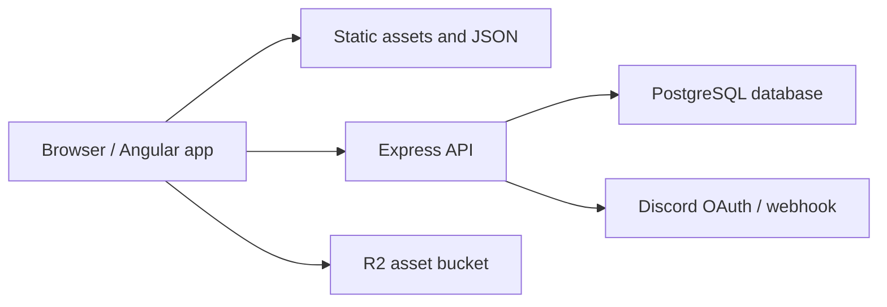

# Avatardle Technical Summary

This document is a technical orientation for contributors who want to understand how Avatardle is built. It assumes basic web development knowledge, but explains the main Angular and Express ideas as they appear in this project.

## Project at a glance

Avatardle is a daily guessing game based on Avatar: The Last Airbender and The Legend of Korra. The project is split into two main applications:

```text
Avatardle/
  Avatardle_Frontend/   Angular app: game UI, routing, static data, translations
  Avatardle_Backend/    Express API: auth, users, stats, leaderboard, profile data
  assets/               Repository-level images used by docs
```

The frontend owns most of the gameplay experience. It loads static JSON data, chooses the daily answers, tracks local progress, renders game modes, and calls the backend when it needs account, stats, leaderboard, or profile behavior.

The backend is a small Node/Express API backed by PostgreSQL. It handles user accounts, JWT cookie authentication, Discord login, user profiles, discovered characters, daily stats, and leaderboard entries.

## High-level request flow



Important patterns:

- Static game data is loaded from `Avatardle_Frontend/src/assets/json/`.
- Character images and UI images live under `Avatardle_Frontend/src/assets/images/`.
- Some large remote assets, such as picture-mode frames, are loaded from `environment.r2AssetUrl`.
- Authenticated API requests use cookies with `withCredentials: true`.
- Daily game state is stored in the browser using `localStorage`.
- Daily reset logic is based on the UTC date.

## Frontend overview

The frontend lives in `Avatardle_Frontend/` and is built with Angular.

Important files:

```text
Avatardle_Frontend/
  angular.json
  package.json
  src/
    main.ts
    server.ts
    styles.scss
    environments/
      environment.ts
      environment.development.ts
    app/
      app.component.*
      app.config.ts
      app.routes.ts
      services/
      guards/
      classic/
      quote/
      picture/
      music/
      leaderboard/
      profile/
    assets/
      json/
      images/
      fonts/
```

### Angular application startup

The app starts in `src/main.ts`:

```ts
bootstrapApplication(AppComponent, appConfig)
```

This is the modern Angular standalone application style. Instead of a root `AppModule`, the app bootstraps a standalone root component and passes shared providers through `app.config.ts`.

`app.config.ts` configures:

- `provideRouter(routes)` for Angular routing
- app initializers for `DataService` and `AuthService`
- `ngx-translate` for translations
- client hydration for server-rendered/static output

The root component, `AppComponent`, imports `RouterOutlet`, navigation helpers, the background component, and the translation pipe. The root layout is responsible for rendering the page shell and letting the router display the active page.

### Routing

Routes are defined in `src/app/app.routes.ts`.

The home route loads `HomeComponent` directly:

```ts
{ path: '', component: HomeComponent }
```

Most feature routes use lazy loading:

```ts
{
  path: 'classic',
  loadComponent: () => import('./classic/classic.component').then(module => module.ClassicMode)
}
```

Lazy loading means Angular does not need to load every game mode immediately when a user opens the site. Instead, it loads code for a page when that route is visited. This keeps the initial app lighter and is a good Angular practice for route-level features.

The profile route uses an auth guard:

```ts
{
  path: 'profile',
  loadComponent: () => import('./profile/profile.component').then(module => module.ProfileComponent),
  canActivate: [authGuard]
}
```

`authGuard` checks `AuthService.isLoggedIn`. If the user is not logged in, it opens the auth dialog and redirects to the home page.

### Environments

API and asset URLs are configured in:

```text
src/environments/environment.ts
src/environments/environment.development.ts
```

Production uses:

```ts
apiUrl: "https://api.avatardle.com"
r2AssetUrl: "https://assets.avatardle.com"
```

Development uses:

```ts
apiUrl: "http://localhost:6060"
r2AssetUrl: "https://pub-bf54e31bfd4a4a6fa8595226bd79196e.r2.dev"
```

Angular replaces the production environment with the development environment when running the dev server.

### Static assets and game data

Most game content is static JSON:

```text
src/assets/json/
  characters.json
  characterFilters.json
  episode.json
  episodes.json
  fanart.json
  full_transcript.json
  osts.json
  particleConfigs.json
  quote_indices.json
  i18n/
    en.json
    es.json
    fr.json
    de.json
    pt.json
```

The Angular build copies `src/assets` into the final application, so the app can fetch these files with paths like `json/characters.json`.

The static data approach is a good fit for a daily guessing game because many gameplay inputs do not need a database call. It also makes content contributions approachable: contributors can fix or add content by editing JSON and assets.

### Core frontend services

Services are shared classes that hold logic used by multiple components.

#### `DataService`

`DataService` loads and exposes game data.

It loads:

- characters
- character filters
- episode names
- quote indices
- fan art
- full transcript data
- picture-mode frame counts
- particle configs
- music/OST data

Some frequently reused HTTP results use `shareReplay`, which lets multiple subscribers reuse the same fetched data instead of triggering duplicate network requests.

It also includes helper methods for:

- selecting valid classic-mode character pools
- selecting quote-mode character pools
- updating daily completion stats
- reading and updating discovered characters
- reading and updating user profiles
- computing the countdown to the next UTC reset
- triggering confetti after a win

#### `LocalStorageService`

`LocalStorageService` stores daily player progress in the browser.

It tracks:

- current UTC date
- progress version
- classic guesses and settings
- quote guesses
- picture guess count
- music guess count
- particle settings
- selected language
- notes notification state

When the UTC date changes, or when the progress version changes, the service resets daily progress while preserving some user preferences.

This is why a player can refresh the page and keep their guesses, but gets a fresh puzzle on the next UTC day.

#### `AuthService`

`AuthService` handles authentication-related API calls:

- sign up
- Discord signup completion
- login
- logout
- `getMe`

It stores login state in an Angular signal:

```ts
isLoggedIn: WritableSignal<boolean> = signal(false)
```

The actual login session is stored by the backend in an HTTP-only cookie. The frontend cannot read that cookie directly, which is good for security. Instead, the frontend asks the backend `/auth/me` endpoint whether the user is logged in.

#### `LeaderboardService`

`LeaderboardService` fetches and submits leaderboard records.

When submitting, it tries to read the current user with `AuthService.getMe()` so it can include the user's element. If that fails, it still submits the leaderboard record with `element: null`.

### Game modes

Each game mode is implemented as an Angular component with its own template, CSS, state, and mode-specific logic.

#### Classic mode

File:

```text
src/app/classic/classic.component.ts
```

Classic mode chooses a deterministic daily character using `rand-seed` with the UTC date and selected series settings. The player guesses characters. For each guess, the component compares the guessed character to the target character across fields like:

- name
- gender
- nationality
- bending element
- affiliations
- first appearance

The result becomes an array of tile data rendered by `TileComponent`. Progress is saved to `LocalStorageService`, and completion triggers:

- discovered-character update
- local completion state
- confetti
- daily stats update
- optional leaderboard submission

#### Quote mode

File:

```text
src/app/quote/quote.component.ts
```

Quote mode has a daily mode and a blitz mode.

Daily quote mode:

- picks a deterministic quote from `quote_indices.json` and `full_transcript.json`
- asks the player to guess the character
- unlocks hints after enough guesses
- saves guesses in local storage
- updates daily stats on completion

Blitz mode:

- picks random quotes continuously
- tracks score and strikes
- uses a countdown timer
- ends when time runs out or the player reaches too many strikes

#### Picture mode

File:

```text
src/app/picture/picture.component.ts
```

Picture mode asks players to guess an episode from a still frame.

The mode:

- chooses a deterministic daily episode
- picks a frame index from `episodes.json`
- loads frame images from the configured R2 asset URL
- starts with the image zoomed and grayscale
- reduces the visual distortion as guesses increase
- unlocks nearby-frame hints after enough guesses

The local progress stores the number of guesses and completion state.

#### Music mode

File:

```text
src/app/music/music.component.ts
```

Music mode uses OST data from `osts.json`. It manages browser audio playback, selected answers, progress through the track, hints, related images, and completion state. It also handles pointer events for the custom audio scrubber and cleans up listeners in `ngOnDestroy`.

### Shared UI components and utilities

Important shared pieces include:

- `TileComponent`: renders classic-mode result tiles
- `ShareResultsComponent`: supports sharing completed game results
- dialog components: auth, help, hint, surrender, settings, image expansion, profile editing
- `game-mode-utils.ts`: shared helper functions for surrender text, surrender availability, and hint tooltip text
- `HyphenatePipe`: formatting helper used by profile/leaderboard UI

Shared utilities are useful because they keep repeated behavior consistent across modes.

### Internationalization

The app uses `@ngx-translate/core`.

Translation files live in:

```text
src/assets/json/i18n/
```

`app.config.ts` configures translation files with:

```ts
prefix: '/json/i18n/'
suffix: '.json'
fallbackLang: 'en'
```

Best practice for contributors: user-facing text should go through translation files when it is part of the app UI. Avoid adding English-only strings directly into templates when the same text should be translated.

### Server-side rendering and hydration

The Angular project includes SSR-related files:

```text
src/main.server.ts
src/server.ts
app.config.server.ts
app.routes.server.ts
```

`server.ts` creates an Express server for serving the built Angular app and rendering application routes. `angular.json` is configured with `outputMode: "static"` and SSR entry points.

Because SSR can run outside the browser, components that access browser-only APIs must guard those calls. This project often uses:

```ts
isPlatformBrowser(this.platformId)
```

That matters for APIs like:

- `window`
- `document`
- `localStorage`
- `HTMLAudioElement`
- browser event listeners

## Angular best practices for this project

These are the patterns contributors should try to follow.

### Keep components focused

Angular components should mainly coordinate UI state, template behavior, and user events. If logic grows large or is shared across pages, move it to:

- a service
- a utility function
- a smaller child component

For example, `game-mode-utils.ts` is a good place for mode-independent helper logic.

### Prefer standalone components and route-level lazy loading

This project already uses standalone components. New routed pages should generally be added as standalone components and lazy-loaded in `app.routes.ts`.

Good pattern:

```ts
{
  path: 'new-mode',
  loadComponent: () => import('./new-mode/new-mode.component').then(m => m.NewModeComponent)
}
```

### Use signals for local reactive state

The project uses Angular signals for component state:

```ts
isComplete: WritableSignal<boolean> = signal(false)
```

Signals are useful because templates can react when signal values change.

Best practices:

- Use `signal` for state that changes over time.
- Use `computed` for values derived from other signals.
- Prefer `set` or `update` over mutating signal-owned arrays/objects in place.
- Keep signal state small and understandable.

Example:

```ts
this.items.update(items => [...items, newItem])
```

That is easier for Angular and future contributors to reason about than pushing into an existing array.

### Use typed data models

`DataService` defines interfaces such as `Character`, `Transcript`, `FanArt`, and `Ost`.

This is good TypeScript practice because it documents the expected shape of data and helps catch mistakes during development.

When adding new JSON-backed data, add or update a TypeScript interface instead of passing around `any`.

### Be careful with subscriptions

When using observables:

- Prefer the `AsyncPipe` in templates when possible.
- Use `shareReplay` for cached data that many components read.
- Unsubscribe from long-lived manual subscriptions in `ngOnDestroy`.
- For future Angular code, consider `takeUntilDestroyed` for cleanup.

This prevents memory leaks and duplicated network calls.

### Guard browser-only APIs

Because this app has SSR/hydration support, do not assume browser globals always exist.

Use browser checks around:

- `window`
- `document`
- `localStorage`
- audio APIs
- pointer-event listeners

The existing pattern is `isPlatformBrowser`.

### Keep API URLs in environment files

Do not hard-code API hostnames inside components. Use `environment.apiUrl` and `environment.r2AssetUrl`.

This lets development and production use different endpoints without changing application code.

### Use Angular forms intentionally

Simple inputs can use template-driven forms with `FormsModule`, as this project often does. For larger forms with validation, nested values, or complex error states, Angular reactive forms are usually easier to maintain.

### Keep templates accessible

For UI changes:

- Use semantic HTML where practical.
- Make buttons actual `<button>` elements.
- Keep focus states usable.
- Add labels or accessible names for controls.
- Do not rely only on color to communicate correctness.
- Test keyboard behavior for dialogs and interactive controls.

### Keep translations in sync

When adding UI text:

- Add the English key to `en.json`.
- Add matching keys to the other locale files when possible.
- Preserve placeholders and formatting across languages.

### Avoid broad unrelated rewrites

For contributors, the easiest PRs to review are focused. If a PR changes gameplay logic, avoid also reformatting unrelated CSS or JSON. If a PR changes translations, avoid also changing auth behavior.

## Backend overview

The backend lives in `Avatardle_Backend/` and uses:

- Express
- PostgreSQL via `pg`
- JWTs via `jsonwebtoken`
- password hashing via `bcrypt`
- cookies via `cookie-parser`
- CORS via `cors`
- scheduled jobs via `node-cron`

Important files:

```text
Avatardle_Backend/
  index.js
  db.js
  middleware/
    verifyToken.js
  routes/
    auth.js
    discovered-characters.js
    leaderboard.js
    stats.js
    users.js
```

### API startup

`index.js` creates the Express app, configures middleware, mounts routers, defines a couple of direct routes, starts the server, and schedules the daily cron job.

Middleware setup:

```js
app.use(express.json());
app.use(cookieParser());
app.use(cors({
  origin: ...,
  credentials: true
}));
```

`express.json()` parses JSON request bodies.

`cookieParser()` makes cookies available at `req.cookies`.

CORS allows the frontend origins and enables credentialed requests, which is required for the browser to send auth cookies to the API.

Allowed origins currently include:

- `http://localhost:4200`
- `https://avatardle.com`

### Database connection

`db.js` exports a PostgreSQL connection pool:

```js
const pool = new Pool({
  connectionString: process.env.DATABASE_URL,
  ssl: {
    rejectUnauthorized: false
  }
});
```

The backend expects `DATABASE_URL` to be available as an environment variable. The app uses parameterized SQL in most routes, which is important for avoiding SQL injection.

### Auth flow

Auth routes live in:

```text
routes/auth.js
```

#### Username/password signup

`POST /auth/signup`

The backend:

1. Reads `username` and `password`.
2. Validates that both exist.
3. Hashes the password with `bcrypt`.
4. Opens a database transaction.
5. Inserts a row into `users`.
6. Inserts a matching row into `user_profiles`.
7. Commits the transaction.

Using a transaction is important because user creation touches more than one table. If the profile insert fails, the user insert should not remain half-complete.

#### Username/password login

`POST /auth/login`

The backend:

1. Looks up the user by username.
2. Compares the submitted password to the stored password hash.
3. Creates a JWT containing `username` and `user_id`.
4. Sends the JWT in a cookie named `token`.

The cookie options are:

```js
{
  httpOnly: true,
  secure: true,
  sameSite: "lax",
  maxAge: 30 * 24 * 60 * 60 * 1000
}
```

`httpOnly` prevents frontend JavaScript from reading the token. `secure` means the cookie should only be sent over HTTPS. `sameSite: "lax"` helps reduce CSRF risk while still allowing normal navigation.

Current implementation note: the JWT is signed with `expiresIn: "7d"`, while the cookie has a 30-day `maxAge`. That means the cookie can remain in the browser after the JWT inside it is expired. A future cleanup could align those lifetimes or add refresh-token behavior.

#### Logout

`POST /auth/logout`

The backend clears the `token` cookie. The frontend then updates its login signal and navigates home.

#### Current user

`GET /auth/me`

This route uses `verifyToken`, then returns the authenticated user's profile data plus username.

### JWT middleware

Protected routes use:

```text
middleware/verifyToken.js
```

The middleware:

1. Reads `req.cookies.token`.
2. Returns `401` if no token exists.
3. Verifies the JWT using `process.env.JWT_SECRET`.
4. Stores the decoded payload on `req.user`.
5. Calls `next()` to continue the request.
6. Returns `403` if token verification fails.

Routes that need the current user should use this middleware.

### Discord login

Discord auth is implemented in `routes/auth.js`.

`GET /auth/discord`:

- creates a random OAuth state
- stores that state in an HTTP-only cookie
- redirects the user to Discord OAuth

`GET /auth/discord/callback`:

- checks the returned state against the cookie
- exchanges the Discord code for an access token
- fetches the Discord user profile
- checks whether a user already exists with that Discord ID
- redirects new Discord users to `/complete-profile`
- logs in existing Discord users by setting the JWT cookie

`POST /auth/discord/signup`:

- creates a new user with `discord_id`
- creates a user profile
- signs and sets a JWT cookie

The OAuth state cookie is important because it helps protect against cross-site request forgery during the Discord login flow.

### User profiles

Profile routes are split between `routes/users.js` and `index.js`.

Public reads:

- `GET /users/:username`
- `GET /users/:username/discovered-characters`

Authenticated profile update:

- `PATCH /updateProfile`

The update route uses `verifyToken`, so users can only update the profile linked to the authenticated JWT.

### Discovered characters

Routes live in:

```text
routes/discovered-characters.js
```

Endpoints:

- `GET /discovered-characters`
- `PATCH /discovered-characters`

Both use `verifyToken`.

The PATCH route inserts a `(user_id, character_id)` pair. If it already exists, the database conflict handler increments `guess_count`.

This lets the app track which characters a logged-in user has discovered across games.

### Leaderboard

Routes live in:

```text
routes/leaderboard.js
```

Endpoints:

- `GET /leaderboard`
- `POST /leaderboard`

`GET /leaderboard` returns leaderboard rows ordered by newest first and formats `created_at` as `HH24:MI`.

`POST /leaderboard` inserts:

- username
- guesses
- element

Current implementation note: leaderboard POST is not protected by `verifyToken`. The frontend tries to attach authenticated user element data when available, but the backend route itself accepts public submissions. If leaderboard integrity becomes important, this route should validate submissions more strictly.

### Stats

Routes live in:

```text
routes/stats.js
```

Endpoints:

- `GET /stats`
- `PATCH /stats`

`GET /stats` returns the daily stats row.

`PATCH /stats` increments one of the allowed mode counters:

- `classic`
- `quote`
- `picture`
- `music`

The route uses an allow-list before building the SQL column name. That allow-list is important because column names cannot be parameterized the same way values can.

### Daily cron job

`index.js` schedules:

```js
cron.schedule('0 0 * * *', async () => { ... })
```

At midnight, the backend:

1. Reads daily stats.
2. Posts a summary to Discord using `DISCORD_WEBHOOK_URL`.
3. Resets daily completion counts.
4. Truncates the leaderboard table and restarts its identity sequence.

This matches the frontend's UTC daily reset concept.

## Backend best practices for this project

### Validate request bodies

Any route that reads `req.body` should validate required fields and expected types before using them. For example, profile updates should ensure fields are strings or arrays in the expected format.

### Use parameterized SQL

Most routes already use parameterized queries:

```js
values: [req.params.username]
```

Keep doing that. Avoid building SQL by concatenating user input.

When dynamic SQL is unavoidable, use allow-lists like the stats route does.

### Protect sensitive writes

Routes that modify user-owned data should use `verifyToken`.

Examples that should be protected:

- profile updates
- discovered characters
- account settings
- any future personal stats

Public writes, like comments or leaderboard entries, should still have validation and abuse protection.

### Keep secrets in environment variables

Never commit secrets. These should stay in the hosting environment:

- `DATABASE_URL`
- `JWT_SECRET`
- `DISCORD_CLIENT_ID`
- `DISCORD_CLIENT_SECRET`
- `DISCORD_WEBHOOK_URL`
- `FIXIE_URL`

### Align token and cookie lifetime

For login cookies, the JWT expiration and cookie expiration should usually tell the same story. If JWTs expire after 7 days but cookies last 30 days, users may keep sending an expired token until logout or cookie cleanup.

A common approach is:

- short-lived access token
- longer-lived refresh token, if needed
- or one cookie/JWT lifetime that matches the desired login duration

### Use transactions for multi-table writes

Signup correctly uses a transaction because it writes to `users` and `user_profiles`. Use the same pattern whenever a future feature needs multiple related database writes.

### Add rate limiting for auth

Login and signup endpoints should eventually have rate limiting to reduce brute-force attempts and spam account creation.

### Add database migrations

The repository currently shows database usage, but not a migration system. As the project grows, migrations would help contributors understand and reproduce the database schema.

Common tools include plain SQL migration files, Knex migrations, Prisma migrations, or node-pg-migrate.

### Add backend tests over time

The backend `npm test` script currently exits with an error placeholder. Useful future tests would cover:

- signup transaction behavior
- login success/failure
- token verification
- profile update authorization
- stats mode validation
- leaderboard validation

## End-to-end feature flow examples

### Classic win flow

1. Angular loads character data from JSON.
2. Classic mode chooses the daily target using UTC date plus `rand-seed`.
3. Player submits guesses.
4. Component compares guessed character fields to target fields.
5. Tile data is saved to local storage.
6. On correct guess, the component:
   - marks local progress complete
   - updates discovered characters if logged in
   - patches daily stats
   - shows confetti
7. Player may submit to the leaderboard.

### Login flow

1. User submits username and password in Angular.
2. `AuthService.login` posts to `/auth/login` with `withCredentials: true`.
3. Express validates credentials with bcrypt.
4. Express signs a JWT and sets it in the `token` cookie.
5. Angular calls `/auth/me` to determine logged-in state.
6. Protected frontend routes, such as `/profile`, read `AuthService.isLoggedIn`.

### Profile page flow

1. Angular route loads `ProfileComponent`.
2. If viewing `/profile`, the auth guard requires login.
3. If viewing `/users/:username`, the page can load public profile data.
4. Profile data comes from `/auth/me` or `/users/:username`.
5. Discovered character counts come from user/discovered-character endpoints.
6. Editing a profile sends a credentialed PATCH to `/updateProfile`.

## How a new contributor should approach changes

1. Identify whether the change is frontend, backend, data, or docs.
2. Find the smallest file or component that owns the behavior.
3. Read nearby code before editing.
4. Match existing naming and style.
5. Keep changes focused.
6. Run the relevant commands.
7. Include manual verification notes in the pull request.

Useful frontend command:

```bash
cd Avatardle_Frontend
npm run build
```

Useful backend command:

```bash
cd Avatardle_Backend
npm ci
```

## Suggested learning path for a student contributor

If someone is new to the project, a good order is:

1. Read `README.md` to understand the product.
2. Read this technical summary.
3. Run the frontend locally.
4. Open `app.routes.ts` to see how pages connect.
5. Read `DataService` and `LocalStorageService`.
6. Pick one game mode, such as Classic, and trace one user action from template to component method.
7. Read `index.js`, `routes/auth.js`, and `verifyToken.js` to understand backend request flow.
8. Make a small docs, translation, or content PR before taking on larger behavior changes.

## Good starter tasks

Good technical starter tasks include:

- Add or correct translation keys.
- Fix a small JSON content issue.
- Improve accessibility labels on one component.
- Add validation to a backend route.
- Add a small utility test once a test setup exists.
- Refactor repeated mode text into translation files.
- Improve error handling for one API call.

The best first task is usually one where the expected behavior is clear and the change touches only a few files.
